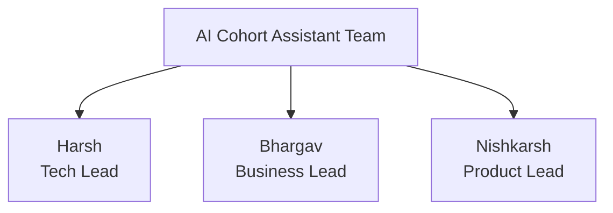
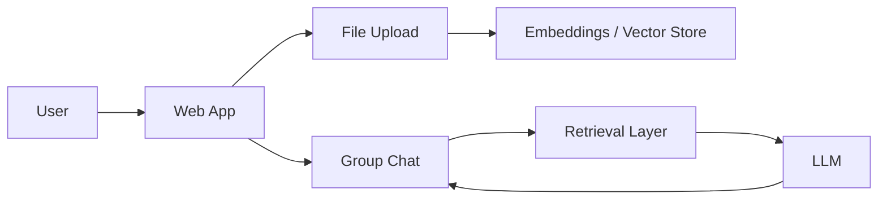

# Milestone 1 Slides Outline

## Slide 1: Project Overview

**Title:** AI Cohort Assistant  
**Subtitle:** Technical Milestone 1

Include:

- one-sentence problem statement,
- one-sentence solution statement,
- team member names and lead roles.

## Slide 2: Problem and Value

Include:

- scattered communication across chats and files,
- repeated questions and mentor dependency,
- value of a domain-specific AI assistant in group chat.

## Slide 3: Team Organization

Include:

- Harsh as Tech Lead,
- Bhargav as Business Lead,
- Nishkarsh as Product Lead,
- note that all members contribute to both technical and business work.

You can paste this diagram:

## Slide 4: Technical Architecture

Include the MVP flow:

## Slide 5: Business Architecture and Roadmap

Include:

- target users,
- pricing tier idea,
- milestone roadmap from Milestone 1 to Milestone 4,
- Milestone 1 completion target of about 30%.

## Presenter note

If you need to keep this very short, Slides 4 and 5 can also be used as the final summary during the video instead of a separate presentation.
