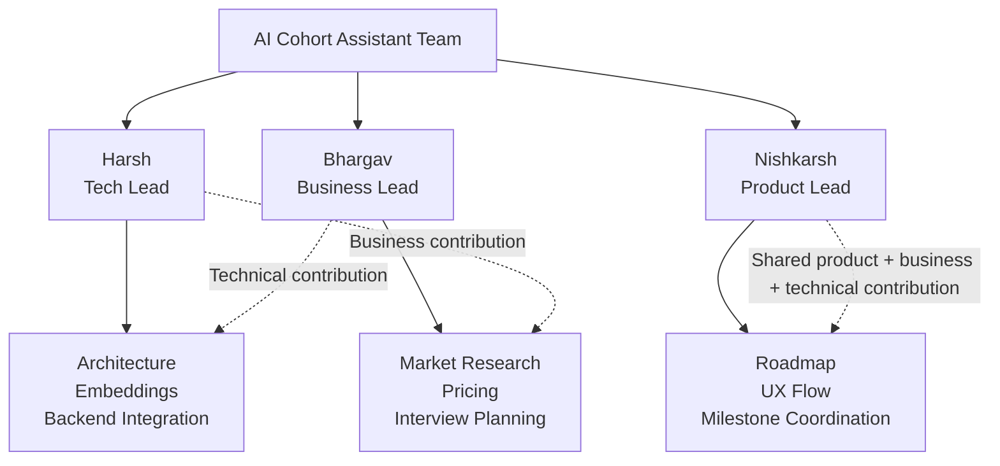
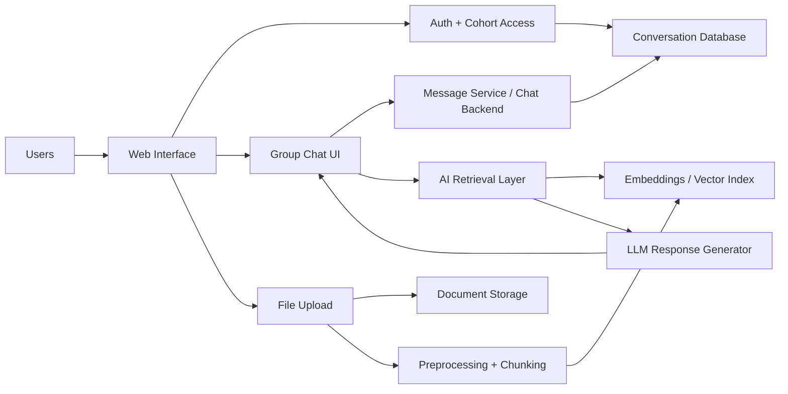
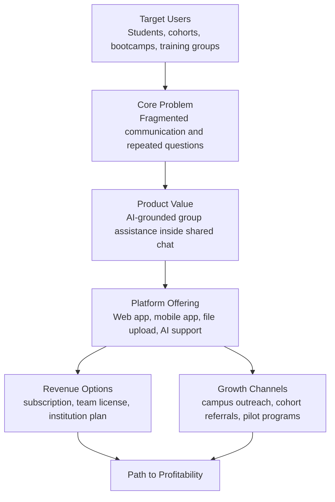

# AI Cohort Assistant

## Technical Milestone 1 Submission Package

### Milestone framing

This submission is for **Technical Milestone 1** of 4 planned milestones for the SCI-560 final project. Because this is the first milestone, the goal is to demonstrate a stable end-to-end prototype that covers approximately **25-30% of the final planned system**, rather than the full production-ready feature set.

For Milestone 1, the team will focus on proving the core workflow:

1. A user joins the platform and enters a cohort or group chat.
2. The user sends messages in a shared group chat environment.
3. The user uploads cohort-related documents or notes.
4. The AI assistant retrieves relevant information from embedded content.
5. The assistant responds inside the group chat with useful domain-specific guidance.

This scope satisfies the milestone expectation of showing the system operating end-to-end while leaving later milestones for advanced features such as a mobile app, analytics, monetization, expanded retrieval quality, image workflows, and production hardening.

## 1. Executive Summary

**AI Cohort Assistant** is a domain-specific AI-enhanced group chat system designed to help members of a learning cohort, training group, or academic/professional community collaborate more effectively. The platform combines:

- real-time group communication,
- file and document sharing,
- an AI assistant grounded in uploaded cohort knowledge using embeddings,
- structured product planning for future business viability.

The problem being addressed is that cohort members often rely on scattered chats, disconnected documents, repeated questions, and limited access to mentors. AI Cohort Assistant centralizes these interactions in a single group environment where members can ask questions, upload context, and receive grounded responses tied to the cohort's shared materials.

## 2. Milestone 1 Objective

The goal of Milestone 1 is to validate the core value proposition with a working MVP. At this stage, success means the team can demonstrate a complete user journey from login to AI-assisted group interaction.

### Planned Milestone 1 feature scope

Included in Milestone 1:

- user authentication and basic onboarding,
- creation or joining of a cohort chat space,
- real-time group messaging,
- file upload for cohort materials,
- document chunking and embeddings pipeline,
- retrieval-augmented AI responses in the chat UI,
- basic web-based interface for the system demo.

Deferred to later milestones:

- full mobile app implementation,
- advanced role permissions,
- polished production deployment,
- pricing/payments integration,
- analytics dashboards,
- image analysis workflows,
- large-scale testing and optimization.

### Estimated completion percentage after Milestone 1

Milestone 1 represents approximately **30% of the full planned product**.

## 3. Team Organization

Based on the current proposal structure, the team leadership is organized as follows:

| Team Member | Primary Role | Business Responsibility | Technical Responsibility |
| --- | --- | --- | --- |
| Harsh | Tech Lead | Technical feasibility input, tooling cost awareness, delivery planning | System architecture, backend integration, embeddings pipeline, technical demo readiness |
| Bhargav | Business Lead | market research, pricing logic, user interviews, profitability framing | support testing, feedback collection, feature validation, business-to-product translation |
| Nishkarsh | Product Lead | user story prioritization, milestone planning, presentation structure | UI flow definition, product integration, acceptance criteria, cross-functional coordination |

### Team organization diagram

## 4. Component Ownership

All members contribute to both business and technical areas, but ownership is distributed to keep execution clear.

| Component | Primary Owner | Supporting Team Members |
| --- | --- | --- |
| Web chat frontend | Nishkarsh | Harsh |
| Authentication and group management | Harsh | Nishkarsh |
| File upload and storage flow | Harsh | Nishkarsh |
| Embeddings and retrieval pipeline | Harsh | Bhargav |
| AI prompt and response quality | Harsh | Nishkarsh, Bhargav |
| User needs validation | Bhargav | Entire team |
| Pricing and market positioning | Bhargav | Nishkarsh |
| Demo flow and milestone presentation | Nishkarsh | Entire team |
| Interview planning for later milestones | Bhargav | Entire team |

## 5. Technical Architecture

The technical design centers on a web-based group chat application integrated with AI retrieval and shared document knowledge.

### Technical architecture diagram

### How the Milestone 1 system works

1. Users log in through the web interface.
2. They enter a cohort-specific group chat.
3. Messages are stored in the chat backend and database.
4. Users upload notes, guides, schedules, or other cohort documents.
5. Uploaded files are processed into chunks and embedded into a searchable vector store.
6. When a user asks a question, the retrieval layer finds relevant chunks.
7. The language model generates a grounded response and returns it to the group chat.

### Milestone 1 technical deliverable

The video should show that the system can complete this pipeline without manual intervention. That means the audience should see the user enter the chat, upload content, ask a question, and receive an answer based on stored cohort knowledge.

## 6. Business Architecture

The business side of the project focuses on the problem, target users, value proposition, and path to monetization.

### Core business idea

AI Cohort Assistant helps learning communities reduce repetitive questions, improve access to guidance, and increase coordination quality. The product is positioned as a productivity and support platform for cohort-based environments such as:

- bootcamps,
- academic project teams,
- learning communities,
- training programs,
- mentorship groups.

### Business architecture diagram

### Early pricing model

Milestone 1 does not require live payment features, but the business structure should already anticipate monetization:

| Tier | Intended User | Example Offering |
| --- | --- | --- |
| Free | student teams / small cohorts | limited messages, limited storage, basic AI queries |
| Pro | active cohorts / bootcamps | larger storage, better AI usage limits, admin controls |
| Institutional | schools / programs / organizations | multi-cohort management, analytics, support, bulk licenses |

## 7. Milestone Roadmap

Because there are four milestones plus a final video, the development should intentionally stage complexity.

| Deliverable | Target Scope | Approx. Product Completion |
| --- | --- | --- |
| Milestone 1 | web MVP, group chat, file upload, embeddings-based AI assistant | 25-30% |
| Milestone 2 | improved retrieval quality, stronger UX, early mobile/app shell, better chat management | 45-55% |
| Milestone 3 | role-based features, image display flow, analytics, business refinement | 65-80% |
| Milestone 4 | testing, deployment polish, interview evidence integration, final feature completion | 90-100% |
| Final Video | polished end-to-end walkthrough with interviews and business pitch | final packaged delivery |

## 8. Weekly Development Schedule

The weekly schedule below balances both business and technical contributions for each member.

| Member | Business Work Each Week | Technical Work Each Week |
| --- | --- | --- |
| Harsh | review feasibility against user and cost constraints, help align tech choices with pricing goals | backend progress, embeddings pipeline, architecture integration, bug fixing |
| Bhargav | market validation, competitor review, pricing logic, interview preparation | test flows, help validate output quality, document business requirements inside the product plan |
| Nishkarsh | prioritize features, prepare demos, coordinate milestone scope, maintain user stories | frontend flow definition, integration testing, UI review, milestone packaging |

### Suggested weekly execution cadence

| Day | Team Focus |
| --- | --- |
| Monday | milestone planning, backlog prioritization, role assignment |
| Tuesday | frontend and backend development, technical blockers review |
| Wednesday | AI integration work, retrieval testing, data/content preparation |
| Thursday | business validation, competitor analysis, presentation updates |
| Friday | integrated testing, demo rehearsal, documentation updates |
| Weekend | contingency work, polishing, recording preparation if needed |

## 9. Milestone 1 Demo Requirements

The Milestone 1 video should show only the features that are already stable enough to defend. A strong video flow would be:

1. Introduce the problem in 20-30 seconds.
2. Show the landing page or login.
3. Enter a cohort chat room.
4. Send a few human messages.
5. Upload a cohort file.
6. Ask the AI a question tied to the uploaded document.
7. Show the AI response in the group chat.
8. End with the roadmap for Milestones 2-4.

This is enough to demonstrate that the platform is functional and that the AI feature is not standalone, but integrated into the domain-specific group chat experience.

## 10. Conclusion

Technical Milestone 1 should present AI Cohort Assistant as a believable and functioning MVP. The focus should remain on the most important proof points:

- shared group chat,
- uploaded knowledge,
- embeddings-backed retrieval,
- useful AI guidance inside the conversation.

That scope is appropriate for the first milestone because it proves the foundation of the product without overcommitting to later-stage features too early.

## Assumptions Used In This Draft

- The project is **AI Cohort Assistant**, based on the proposal PDF structure.
- The current visible leadership team is Harsh, Bhargav, and Nishkarsh.
- The first milestone is expected to show approximately **20-40%** of planned functionality, so this package frames the demo at **about 30%** completion.
- If your instructor expects exact stack names or additional team members, those can be added quickly on top of this draft.
